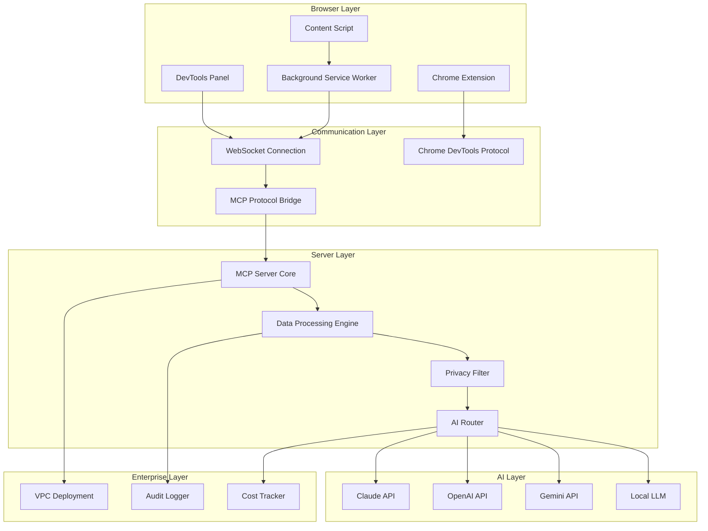

# DevTools Bridge MCP - 技術アーキテクチャ設計

## 🏗️ システム全体アーキテクチャ



## 📱 Chrome Extension Architecture

### Manifest V3 Configuration
```json
{
  "manifest_version": 3,
  "name": "DevTools Bridge MCP",
  "version": "1.0.0",
  "description": "AI-powered debugging assistant with real-time DevTools integration",
  "permissions": [
    "debugger",
    "activeTab",
    "storage",
    "background"
  ],
  "host_permissions": [
    "<all_urls>"
  ],
  "background": {
    "service_worker": "background.js",
    "type": "module"
  },
  "devtools_page": "devtools.html",
  "content_scripts": [{
    "matches": ["<all_urls>"],
    "js": ["content.js"]
  }],
  "action": {
    "default_popup": "popup.html"
  }
}
```

### Component Structure
```typescript
// src/extension/
├── background/
│   ├── background.ts          // Service Worker - WebSocket管理
│   ├── devtools-bridge.ts     // DevTools Protocol統合
│   └── message-router.ts      // メッセージルーティング
├── devtools/
│   ├── devtools.html          // DevTools Panel HTML
│   ├── devtools.tsx           // React DevTools UI
│   ├── ai-chat.tsx           // AI Chat Interface
│   └── settings.tsx          // Settings Panel
├── content/
│   ├── content.ts            // Content Script
│   └── dom-monitor.ts        // DOM変更監視
├── popup/
│   ├── popup.html
│   ├── popup.tsx             // Extension Popup
│   └── connection-status.tsx // 接続状態表示
└── shared/
    ├── types.ts              // 共通型定義
    ├── config.ts             // 設定管理
    └── utils.ts              // ユーティリティ
```

## 🔌 Chrome DevTools Protocol Integration

### Console Log Capture
```typescript
// background/devtools-bridge.ts
export class DevToolsBridge {
  private debuggerAttached = false;
  private tabId: number;
  
  async attachDebugger(tabId: number) {
    try {
      await chrome.debugger.attach({ tabId }, "1.3");
      this.debuggerAttached = true;
      this.tabId = tabId;
      
      // Enable Runtime domain for console
      await chrome.debugger.sendCommand({ tabId }, "Runtime.enable");
      
      // Enable Network domain
      await chrome.debugger.sendCommand({ tabId }, "Network.enable");
      
      // Enable Performance domain
      await chrome.debugger.sendCommand({ tabId }, "Performance.enable");
      
      this.setupEventListeners();
    } catch (error) {
      console.error("Failed to attach debugger:", error);
    }
  }
  
  private setupEventListeners() {
    chrome.debugger.onEvent.addListener((source, method, params) => {
      if (source.tabId !== this.tabId) return;
      
      switch (method) {
        case "Runtime.consoleAPICalled":
          this.handleConsoleLog(params);
          break;
        case "Runtime.exceptionThrown":
          this.handleException(params);
          break;
        case "Network.responseReceived":
          this.handleNetworkResponse(params);
          break;
        case "Network.loadingFailed":
          this.handleNetworkError(params);
          break;
      }
    });
  }
  
  private async handleConsoleLog(params: any) {
    const logEntry = {
      type: 'console',
      level: params.type,
      args: params.args,
      timestamp: Date.now(),
      url: params.executionContextId,
      stackTrace: params.stackTrace
    };
    
    await this.sendToMCPServer(logEntry);
  }
  
  private async handleException(params: any) {
    const errorEntry = {
      type: 'error',
      message: params.exceptionDetails.text,
      url: params.exceptionDetails.url,
      lineNumber: params.exceptionDetails.lineNumber,
      columnNumber: params.exceptionDetails.columnNumber,
      stackTrace: params.exceptionDetails.stackTrace,
      timestamp: Date.now()
    };
    
    await this.sendToMCPServer(errorEntry);
  }
}
```

### Network Monitoring
```typescript
interface NetworkEvent {
  type: 'network';
  requestId: string;
  url: string;
  method: string;
  headers: Record<string, string>;
  statusCode?: number;
  statusText?: string;
  mimeType?: string;
  failed?: boolean;
  errorText?: string;
  timestamp: number;
}

class NetworkMonitor {
  private requests = new Map<string, Partial<NetworkEvent>>();
  
  handleRequestWillBeSent(params: any) {
    const event: Partial<NetworkEvent> = {
      type: 'network',
      requestId: params.requestId,
      url: params.request.url,
      method: params.request.method,
      headers: params.request.headers,
      timestamp: Date.now()
    };
    
    this.requests.set(params.requestId, event);
  }
  
  handleResponseReceived(params: any) {
    const existing = this.requests.get(params.requestId);
    if (existing) {
      existing.statusCode = params.response.status;
      existing.statusText = params.response.statusText;
      existing.mimeType = params.response.mimeType;
      
      // Send to MCP if error status
      if (params.response.status >= 400) {
        this.sendErrorToMCP(existing as NetworkEvent);
      }
    }
  }
  
  handleLoadingFailed(params: any) {
    const existing = this.requests.get(params.requestId);
    if (existing) {
      existing.failed = true;
      existing.errorText = params.errorText;
      this.sendErrorToMCP(existing as NetworkEvent);
    }
  }
}
```

## 🌐 MCP Server Core Architecture

### Server Structure
```typescript
// server/
├── src/
│   ├── core/
│   │   ├── mcp-server.ts         // MCP Protocol実装
│   │   ├── websocket-server.ts   // WebSocket通信
│   │   └── message-handler.ts    // メッセージ処理
│   ├── ai/
│   │   ├── ai-router.ts          // AI選択・ルーティング
│   │   ├── claude-client.ts      // Claude API統合
│   │   ├── openai-client.ts      // OpenAI API統合
│   │   ├── gemini-client.ts      // Gemini API統合
│   │   └── local-llm-client.ts   // Local LLM統合
│   ├── privacy/
│   │   ├── data-filter.ts        // データフィルタリング
│   │   ├── masking-engine.ts     // センシティブデータマスキング
│   │   └── privacy-config.ts     // プライバシー設定
│   ├── processing/
│   │   ├── data-processor.ts     // データ前処理
│   │   ├── context-manager.ts    // コンテキスト管理
│   │   └── token-optimizer.ts    // トークン最適化
│   └── enterprise/
│       ├── audit-logger.ts       // 監査ログ
│       ├── cost-tracker.ts       // コスト追跡
│       └── vpc-config.ts         // VPC設定
└── docker/
    ├── Dockerfile
    ├── docker-compose.yml
    └── docker-compose.enterprise.yml
```

### MCP Protocol Implementation
```typescript
// core/mcp-server.ts
import { Server } from '@modelcontextprotocol/sdk/server/index.js';
import { StdioServerTransport } from '@modelcontextprotocol/sdk/server/stdio.js';

export class DevToolsMCPServer {
  private server: Server;
  private aiRouter: AIRouter;
  private dataFilter: DataFilter;
  
  constructor() {
    this.server = new Server(
      {
        name: "devtools-bridge-mcp",
        version: "1.0.0",
      },
      {
        capabilities: {
          tools: {},
          prompts: {},
          resources: {}
        },
      }
    );
    
    this.setupHandlers();
  }
  
  private setupHandlers() {
    // DevTools data processing tool
    this.server.setRequestHandler('tools/call', async (request) => {
      if (request.params.name === 'analyze_devtools_data') {
        return await this.analyzeDevToolsData(request.params.arguments);
      }
    });
    
    // Real-time debugging prompt
    this.server.setRequestHandler('prompts/get', async (request) => {
      if (request.params.name === 'debug_analysis') {
        return await this.generateDebugPrompt(request.params.arguments);
      }
    });
  }
  
  async analyzeDevToolsData(data: DevToolsData): Promise<any> {
    // 1. Privacy filtering
    const filteredData = await this.dataFilter.filterSensitiveData(data);
    
    // 2. Context optimization
    const optimizedContext = await this.optimizeForAI(filteredData);
    
    // 3. AI analysis
    const analysis = await this.aiRouter.analyze(optimizedContext);
    
    return {
      content: [{
        type: "text",
        text: analysis.response
      }]
    };
  }
}
```

## 🔒 Privacy & Security Layer

### Data Filtering Engine
```typescript
// privacy/data-filter.ts
export class DataFilter {
  private sensitivePatterns: RegExp[];
  private maskingRules: MaskingRule[];
  
  constructor(config: PrivacyConfig) {
    this.sensitivePatterns = [
      /api[_-]?key/i,
      /password/i,
      /token/i,
      /secret/i,
      /authorization/i,
      /cookie/i,
      /session/i,
      /bearer\s+[a-zA-Z0-9-._~+/]+=*/i,
      /\b[A-Za-z0-9._%+-]+@[A-Za-z0-9.-]+\.[A-Z|a-z]{2,}\b/i, // Email
      /\b\d{4}[-.\s]?\d{4}[-.\s]?\d{4}[-.\s]?\d{4}\b/i, // Credit card
      /\b\d{3}-\d{2}-\d{4}\b/i // SSN
    ];
    
    this.maskingRules = config.maskingRules || [];
  }
  
  async filterSensitiveData(data: DevToolsData): Promise<DevToolsData> {
    const filtered = { ...data };
    
    // Filter console logs
    if (filtered.console) {
      filtered.console = filtered.console.map(log => ({
        ...log,
        args: this.maskArguments(log.args)
      }));
    }
    
    // Filter network requests
    if (filtered.network) {
      filtered.network = filtered.network.map(req => ({
        ...req,
        headers: this.maskHeaders(req.headers),
        url: this.maskUrl(req.url)
      }));
    }
    
    return filtered;
  }
  
  private maskArguments(args: any[]): any[] {
    return args.map(arg => {
      if (typeof arg === 'string') {
        return this.maskString(arg);
      }
      if (typeof arg === 'object') {
        return this.maskObject(arg);
      }
      return arg;
    });
  }
  
  private maskString(str: string): string {
    let masked = str;
    
    this.sensitivePatterns.forEach(pattern => {
      masked = masked.replace(pattern, (match) => {
        return '[REDACTED]';
      });
    });
    
    return masked;
  }
  
  private maskHeaders(headers: Record<string, string>): Record<string, string> {
    const masked = { ...headers };
    
    Object.keys(masked).forEach(key => {
      if (this.isSensitiveHeader(key)) {
        masked[key] = '[REDACTED]';
      }
    });
    
    return masked;
  }
  
  private isSensitiveHeader(key: string): boolean {
    const sensitiveHeaders = [
      'authorization',
      'cookie',
      'x-api-key',
      'x-auth-token',
      'authentication'
    ];
    
    return sensitiveHeaders.some(header => 
      key.toLowerCase().includes(header)
    );
  }
}
```

### Preview & Confirmation UI
```typescript
// devtools/privacy-preview.tsx
export const PrivacyPreview: React.FC<{
  data: DevToolsData;
  onConfirm: (data: DevToolsData) => void;
  onCancel: () => void;
}> = ({ data, onConfirm, onCancel }) => {
  const [previewData, setPreviewData] = useState<DevToolsData>();
  const [userConsent, setUserConsent] = useState(false);
  
  useEffect(() => {
    // Show what will be sent to AI
    const processData = async () => {
      const filtered = await dataFilter.filterSensitiveData(data);
      setPreviewData(filtered);
    };
    processData();
  }, [data]);
  
  return (
    <div className="privacy-preview">
      <h3>🔒 Data Preview - What will be sent to AI</h3>
      
      <div className="data-preview">
        <JSONViewer 
          src={previewData} 
          collapsed={1}
          name="DevTools Data"
        />
      </div>
      
      <div className="consent-section">
        <label>
          <input
            type="checkbox"
            checked={userConsent}
            onChange={(e) => setUserConsent(e.target.checked)}
          />
          I confirm this data is safe to send to AI assistant
        </label>
      </div>
      
      <div className="actions">
        <button onClick={onCancel}>Cancel</button>
        <button 
          onClick={() => onConfirm(previewData!)}
          disabled={!userConsent}
        >
          Send to AI
        </button>
      </div>
    </div>
  );
};
```

## 🤖 Multi-AI Router Implementation

```typescript
// ai/ai-router.ts
export class AIRouter {
  private clients: Map<AIProvider, AIClient>;
  private defaultProvider: AIProvider;
  
  constructor(config: AIConfig) {
    this.clients = new Map();
    this.clients.set('claude', new ClaudeClient(config.claude));
    this.clients.set('openai', new OpenAIClient(config.openai));
    this.clients.set('gemini', new GeminiClient(config.gemini));
    this.clients.set('local', new LocalLLMClient(config.local));
    
    this.defaultProvider = config.defaultProvider || 'claude';
  }
  
  async analyze(data: DevToolsData, provider?: AIProvider): Promise<AIResponse> {
    const selectedProvider = provider || this.defaultProvider;
    const client = this.clients.get(selectedProvider);
    
    if (!client) {
      throw new Error(`AI provider ${selectedProvider} not configured`);
    }
    
    const prompt = this.buildAnalysisPrompt(data);
    
    try {
      const response = await client.analyze(prompt);
      return {
        provider: selectedProvider,
        response: response.content,
        cost: response.cost,
        tokens: response.tokens,
        timestamp: Date.now()
      };
    } catch (error) {
      // Fallback to alternative provider
      return await this.handleFailover(data, selectedProvider, error);
    }
  }
  
  private buildAnalysisPrompt(data: DevToolsData): string {
    return `
# DevTools Debug Analysis Request

## Console Errors
${data.console?.filter(log => log.level === 'error').map(log => 
  `- ${log.timestamp}: ${log.args.join(' ')}`
).join('\n')}

## Network Issues  
${data.network?.filter(req => req.failed || (req.statusCode && req.statusCode >= 400)).map(req =>
  `- ${req.method} ${req.url}: ${req.statusCode || 'FAILED'} ${req.errorText || req.statusText}`
).join('\n')}

## Current Page Context
- URL: ${data.pageInfo?.url}
- User Agent: ${data.pageInfo?.userAgent}
- Viewport: ${data.pageInfo?.viewport}

Please analyze these issues and provide:
1. Root cause analysis
2. Specific fix recommendations
3. Prevention strategies
4. Code examples if applicable

Focus on actionable insights that can help debug and resolve these issues quickly.
    `;
  }
}
```

## 📊 Cost Tracking & Management

```typescript
// enterprise/cost-tracker.ts
export class CostTracker {
  private costs: Map<string, CostEntry[]> = new Map();
  
  async trackAPICall(
    provider: AIProvider,
    tokens: number,
    cost: number,
    userId?: string
  ) {
    const entry: CostEntry = {
      provider,
      tokens,
      cost,
      timestamp: Date.now(),
      userId: userId || 'anonymous'
    };
    
    const userCosts = this.costs.get(entry.userId) || [];
    userCosts.push(entry);
    this.costs.set(entry.userId, userCosts);
    
    // Check budget limits
    await this.checkBudgetLimits(entry.userId);
  }
  
  async generateCostReport(userId: string, period: 'day' | 'week' | 'month') {
    const userCosts = this.costs.get(userId) || [];
    const timeRange = this.getTimeRange(period);
    
    const filteredCosts = userCosts.filter(cost => 
      cost.timestamp >= timeRange.start && cost.timestamp <= timeRange.end
    );
    
    const report = {
      totalCost: filteredCosts.reduce((sum, cost) => sum + cost.cost, 0),
      totalTokens: filteredCosts.reduce((sum, cost) => sum + cost.tokens, 0),
      byProvider: this.groupByProvider(filteredCosts),
      dailyBreakdown: this.getDailyBreakdown(filteredCosts)
    };
    
    return report;
  }
}
```

## 🐳 Docker Deployment

```dockerfile
# Dockerfile
FROM node:20-alpine

WORKDIR /app

# Install dependencies
COPY package*.json ./
RUN npm ci --only=production

# Copy source code
COPY dist/ ./dist/
COPY public/ ./public/

# Create non-root user
RUN addgroup -g 1001 -S nodejs
RUN adduser -S mcp -u 1001
USER mcp

EXPOSE 8080

CMD ["node", "dist/server.js"]
```

```yaml
# docker-compose.yml
version: '3.8'

services:
  devtools-mcp:
    build: .
    ports:
      - "8080:8080"
    environment:
      - NODE_ENV=production
      - MCP_HOST=0.0.0.0
      - MCP_PORT=8080
    volumes:
      - ./config:/app/config:ro
      - ./logs:/app/logs
    restart: unless-stopped

  redis:
    image: redis:alpine
    volumes:
      - redis_data:/data
    restart: unless-stopped

volumes:
  redis_data:
```

## 🎯 Next Steps

この詳細アーキテクチャに基づき、次は**Chrome拡張機能のMVP実装**から開始します。

実装準備完了です！どのコンポーネントから始めますか？