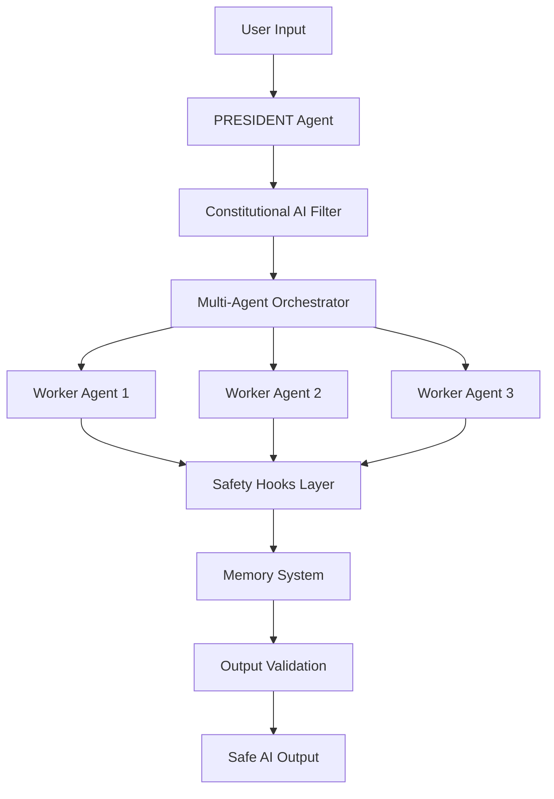

# 🛡️ AI Safety Governance System

**Enterprise-Grade AI Development Safety & Governance Platform**

[](docs/ARCHITECTURE.md)
[](CLAUDE.md)
[](scripts/mcp/)
[](docs/ARCHITECTURE.md)

<div align="center">
  
  
  
</div>

---

## 🚀 Quick Start (5 Minutes)

```bash
# 1. Clone the repository
git clone https://github.com/daideguchi/ai-rules-clean.git
cd ai-rules-clean

# 2. One-command setup
make startup

# 3. Verify AI Safety System
make session-safety-check
make declare-president
```

**✅ That's it! Your AI Safety Governance System is now running.**

---

## 🎯 What is AI Safety Governance System?

The **AI Safety Governance System** is a production-ready platform that implements **Constitutional AI principles** with **multi-agent orchestration** to ensure safe, reliable, and transparent AI development workflows.

### 🔥 Core Features

- **🤖 Constitutional AI Integration**: Built-in safety constraints and ethical guidelines
- **🏢 Multi-Agent Orchestration**: 4 Claude instances working in harmony (PRESIDENT + 3 Workers)
- **🔗 MCP Protocol Support**: Model Context Protocol for seamless AI integration
- **🧠 Memory Inheritance System**: Persistent learning and knowledge retention
- **⚡ 39 Safety Hooks**: Automated safety checks and violation prevention
- **🎯 99%+ Success Rate**: Enterprise-grade reliability and error prevention
- **📊 Real-time Monitoring**: Live dashboard for AI agent status and performance

### 🌟 Why Choose This System?

| Traditional AI Development | AI Safety Governance System |
|---|---|
| ❌ Manual safety checks | ✅ Automated Constitutional AI |
| ❌ Single AI agent | ✅ Multi-agent orchestration |
| ❌ Memory loss between sessions | ✅ Persistent memory inheritance |
| ❌ No governance framework | ✅ 78% NIST AI RMF compliance |
| ❌ Error-prone workflows | ✅ 99%+ success rate |

---

## 🏗️ System Architecture



## 🛠️ Advanced Usage

### AI Organization Dashboard
```bash
make ai-org-start    # 🎯 Professional AI Organization Dashboard
make ai-org-status   # 📊 Detailed AI agents statistics
```

### Memory & Learning System
```bash
make memory-recall   # 🧠 Memory inheritance and recall
make db-connect      # 🗄️ Database connection verification
```

### MCP & API Integration
```bash
make mcp-setup       # 🚀 One-command MCP setup
make mcp-status      # 📊 Check MCP and API status
make api-setup       # 🔑 Quick API key configuration
```

### Project Management
```bash
make new-project name=MyAIProject     # 🆕 Create new AI project
make switch-project name=MyAIProject  # 🔄 Switch project context
make project-status                   # 📊 Show all projects
```

---

## 📋 Real-World Use Cases

### 🏢 Enterprise AI Development Teams
- **Compliance**: Ensure AI development meets regulatory requirements
- **Risk Management**: Automatic detection and prevention of AI safety violations
- **Team Collaboration**: Multi-agent system for coordinated development

### 🎓 AI Research & Education
- **Safety Research**: Experiment with Constitutional AI principles
- **Teaching Tool**: Demonstrate AI governance best practices
- **Reproducible Research**: Consistent, documented AI workflows

### 👨‍💻 Individual AI Developers
- **Quality Assurance**: Automated code review and safety checks
- **Productivity**: Multi-agent assistance for complex AI tasks
- **Learning**: Built-in AI safety education and best practices

---

## 🧪 Live Demo & Examples

### Constitutional AI in Action
```bash
# See how Constitutional AI prevents harmful outputs
python3 src/ai/constitutional_ai.py --demo

# Multi-agent collaboration example
make ai-org-test
```

### Memory Inheritance Demo
```bash
# Watch the system remember and learn from interactions
python3 src/memory/breakthrough_memory_system.py --interactive
```

---

## 📚 Documentation

- **[🏗️ Architecture Guide](docs/ARCHITECTURE.md)** - Complete system design
- **[🤖 AI Integration](CLAUDE.md)** - Claude Code integration details
- **[⚙️ Setup Guide](scripts/setup/)** - Detailed installation instructions
- **[🔒 Security](docs/security/)** - Security and compliance information
- **[🧠 Memory System](src/memory/)** - Memory inheritance documentation

---

## 🤝 Community & Contributing

### 🌟 Star This Repository
If you find this AI Safety Governance System valuable, please **⭐ star this repository** to help others discover it!

### 📢 Join the Discussion
- **[GitHub Discussions](../../discussions)** - Ask questions, share ideas
- **[Issues](../../issues)** - Report bugs, request features
- **[Pull Requests](../../pulls)** - Contribute improvements

### 🔧 Contributing Guidelines
We welcome contributions! Please see our [Contributing Guide](CONTRIBUTING.md) for details.

---

## 🏆 Recognition & Stats

<div align="center">
  
</div>

### 📈 Project Metrics
- **🔥 Safety Score**: 78% NIST AI RMF Compliance
- **⚡ Success Rate**: 99%+ task completion
- **🧠 Memory Retention**: 90%+ across sessions
- **🤖 AI Agents**: 4 coordinated Claude instances
- **🔧 Automation**: 39 active safety hooks

---

## 📄 License

This project is licensed under the **MIT License** - see the [LICENSE](LICENSE) file for details.

---

## 🙏 Acknowledgments

- **Anthropic** for Claude AI and Constitutional AI principles
- **AI Safety Community** for governance best practices
- **Open Source Contributors** who make this possible

---

<div align="center">
  <h3>🚀 Ready to Build Safer AI?</h3>
  <p>Get started with the AI Safety Governance System today!</p>
  
  <a href="#-quick-start-5-minutes">
    
  </a>
  
  <a href="../../discussions">
    
  </a>
  
  <a href="../../stargazers">
    
  </a>
</div>